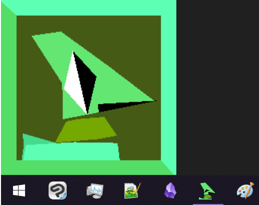
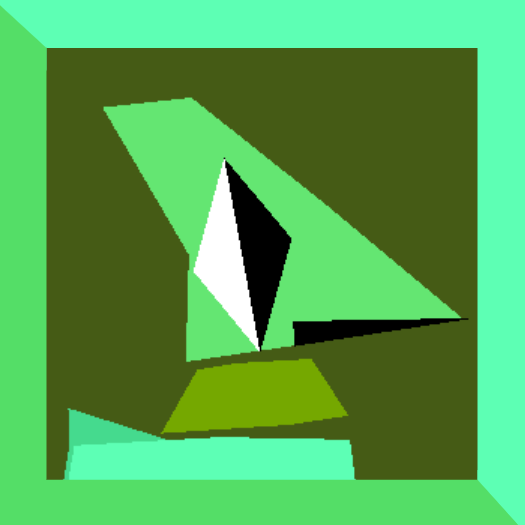

# Garn47 Drill Dragon Helper 



Drilly from the game Garn47 by Floombo! They're real now!

## Features

- Full 3D!
- Randomly makes sounds like the game!
- Repositionable by dragging the green frame!

## Use
- Drag frame to move around screen, (by default corner-snapping is enabled)
- Right-click the frame or press escape for options menu


## Installation

Latest build here: [Latest Release](https://github.com/Mrpalland/DrillDragonHelper/releases/latest)

## License

Drilly's design, model and sounds are from Garn47, a game by Floombo. This repo uses assets that were created by and belong to Floombo under the [CC BY-NC-SA](https://creativecommons.org/licenses/by-nc-sa/4.0/) license. The assets in the `assets` directory remain under the `CC BY-NC-SA` license.


> Changes to the Assets: The Drilly model has been tweaked slightly to allow for easy import into Godot.

## Issues

### Known Issues

- [ ] Corner Snapping can break with multiple monitors
- [ ] Limited interaction
- [ ] Asset loading from directory may not be robust on all platforms

## Planned Features

- [ ] More interactive features and animations
- [ ] Customizable appearance/custom models
- [ ] More window settings
- [ ] Start on system boot

## Building from Source

- Godot 4.2.2 mono or higher

### Clone the Repository

```bash
git clone "https://github.com/Mrpalland/DrillDragonHelper.git"
cd DrillDragonHelper
```

## Acknowledgements

- Thanks to Floombo for being totally garnular and supplying Drilly's assets to their community and their continued work on the game Garn47.

- 
